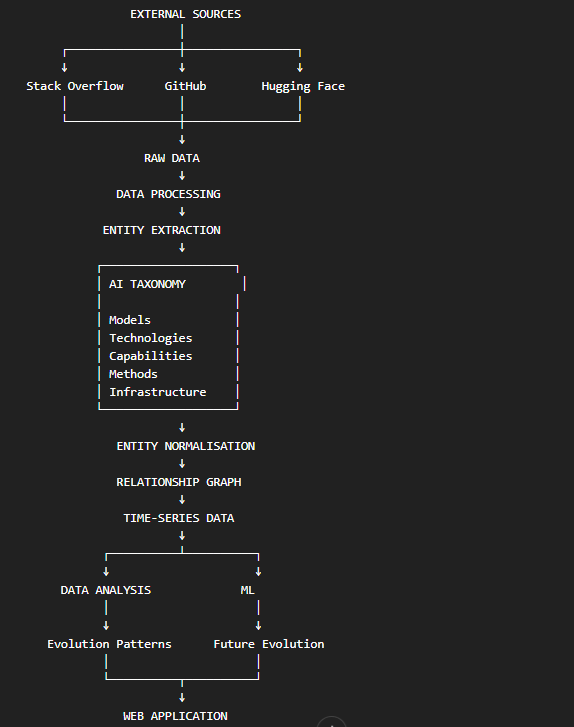

# AI Technology Taxonomy and Entity Normalisation

**Project:** Machine Learning-Based AI Technology Evolution Analysis and Future Trend Prediction Platform

**Document Version:** 1.0

**Date:** 18 August 2026

**Status:** Initial Taxonomy Design

## 1. Taxonomy Objectives

The purpose of the AI technology taxonomy is to provide a consistent representation of AI technologies, models, capabilities, development methods, and infrastructure concepts identified across multiple external data sources.

The taxonomy is required because the same technology may be represented differently across Stack Overflow, GitHub, Hugging Face, and other sources.

The main objectives are:

1. Create a consistent vocabulary for AI technologies.
2. Reduce duplicate technology names.
3. Identify relationships between technologies.
4. Distinguish AI models from broader technologies.
5. Distinguish capabilities from implementation technologies.
6. Support cross-source data integration.
7. Support time-series analysis of technology evolution.
8. Support machine learning feature engineering.
9. Support technology relationship analysis.
10. Provide a foundation for future technology trend analysis.

## 2. Why Normalisation Is Required

The collected data sources use different terminology and structures.

For example, a technology may appear as:

```text
RAG
rag
Retrieval-Augmented Generation
retrieval augmented generation
GraphRAG
Agentic RAG


## 3. Taxonomy Structure

The initial taxonomy will contain several major entity categories.

```text
AI Ecosystem
│
├── Models
│   ├── Foundation Models
│   ├── Language Models
│   ├── Vision Models
│   ├── Multimodal Models
│   └── Speech / Audio Models
│
├── Technologies
│   ├── RAG
│   ├── AI Agents
│   ├── Tool Calling
│   ├── MCP
│   ├── Multimodal AI
│   └── Other emerging technologies
│
├── Capabilities
│   ├── Reasoning
│   ├── Text Generation
│   ├── Code Generation
│   ├── Vision
│   ├── Audio
│   ├── Embeddings
│   └── Retrieval
│
├── Development Methods
│   ├── Fine-Tuning
│   ├── LoRA
│   ├── RLHF
│   ├── DPO
│   └── Quantization
│
└── Infrastructure
    ├── Vector Databases
    ├── Model Serving
    ├── Inference
    ├── Orchestration
    └── AI Frameworks

    
## 4. Entity Types

Each detected AI-related concept will be assigned an entity type.

### 4.1 Model

Represents a specific AI model or model version.

Examples:

```text
GPT-4
GPT-4o
Claude 3.5 Sonnet
Llama 3.1
Qwen3
Gemma

## 5. Canonical Names

Each normalised entity will have a canonical name.

The canonical name will be the standard internal representation used throughout the database and analytical pipeline.

For example:

| Raw Value | Canonical Entity |
|---|---|
| `rag` | Retrieval-Augmented Generation |
| `RAG` | Retrieval-Augmented Generation |
| `retrieval augmented generation` | Retrieval-Augmented Generation |
| `openai-api` | OpenAI API |
| `langchain` | LangChain |
| `tool-calling` | Tool Calling |

The original source value will still be preserved.

This creates the following relationship:

```text
Source Value
    ↓
Canonical Entity


## 6. Entity Aliases

An entity may have multiple recognised aliases.

For example:

```text
Canonical Entity:
Retrieval-Augmented Generation

Aliases:
RAG
rag
Retrieval Augmented Generation
Retrieval-Augmented Generation


## 7. Entity Relationships

The system will represent relationships between AI entities.

Relationships may exist between:

- Models and model families.
- Models and organisations.
- Models and capabilities.
- Technologies and capabilities.
- Technologies and infrastructure.
- Technologies and development methods.
- Models and technologies.
- Technologies and technologies.

Examples:

```text
GPT-4
   ↓ belongs_to
GPT

GPT-4
   ↓ developed_by
OpenAI

RAG
   ↓ uses
Vector Database

AI Agent
   ↓ uses
Tool Calling

AI Agent
   ↓ related_to
MCP

Llama 3
   ↓ supports
Text Generation


## 8. Technology Hierarchy

Some technologies may contain sub-technologies or specialised variants.

For example:

```text
Retrieval-Augmented Generation
│
├── GraphRAG
├── Agentic RAG
└── Multimodal RAG


## 9. Model Relationships

Models will be represented separately from technologies.

For example:

```text
GPT-4o
   ↓ belongs_to
GPT Family


## 10. Cross-Source Entity Mapping

The same entity may appear across multiple data sources.

For example:

```text
Stack Overflow:
"langchain"

GitHub:
"langchain"

Hugging Face:
"langchain"


## 11. Entity Classification Confidence

Entity identification and classification may not always be certain.

The system will therefore support a confidence score for automatically identified entities.

For example:

```text
Detected Term:
"RAG"

Entity:
Retrieval-Augmented Generation

Confidence:
0.99


## 12. Source-Specific Evidence

Each entity classification should retain information about why the system identified an entity.

Examples of evidence include:

```text
Stack Overflow:
Tag = "rag"

GitHub:
Topic = "rag"

GitHub:
Description contains "retrieval augmented generation"

Hugging Face:
Tag = "rag"


## 13. Temporal Entity Tracking

AI technologies change over time.

The system will therefore treat technology observations as time-dependent.

For each relevant observation, the system may record:

- Entity ID
- Source
- Observation date
- Activity measure
- Classification confidence
- Related entities

This allows the system to construct time-series datasets.

For example:

```text
Technology: AI Agents

2023 → low activity
2024 → increasing activity
2025 → rapid growth
2026 → continued expansion


## 14. Emerging Technology Detection

The system will investigate methods for identifying technologies that demonstrate increasing activity across the collected data.

Potential signals include:

- Growth in developer discussions.
- Growth in GitHub repositories.
- Growth in model ecosystem activity.
- Increasing technology relationships.
- Increasing organisational participation.
- Increasing model support.
- Increasing benchmark coverage.

A technology may therefore be considered an emerging candidate when multiple independent signals demonstrate sustained growth.

The system will not classify a technology as emerging based on a single observation or source.

## 15. Technology Evolution Score

The project will investigate the development of a composite Technology Evolution Score.

The score is intended to summarise multiple dimensions of technology development.

Potential dimensions include:

```text
Developer Activity
Open-Source Activity
Model Ecosystem Activity
Adoption
Technology Relationships
Growth


## 16. Evolution Versus Quality

The project distinguishes between technology evolution and technology quality.

A technology may demonstrate rapid growth without necessarily being technically superior.

Similarly, a technically strong technology may have limited public activity.

Therefore:

```text
Evolution
≠
Quality


## 17. Initial Taxonomy Example

An example representation of the taxonomy is:

```text
AI Agent
│
├── related_to → MCP
├── uses → Tool Calling
├── uses → RAG
├── supports → Reasoning
└── implemented_by → AI Framework

RAG
│
├── uses → Vector Database
├── related_to → Embeddings
├── related_to → Knowledge Graph
└── implemented_by → LangChain

GPT-4o
│
├── belongs_to → GPT Family
├── developed_by → OpenAI
├── supports → Multimodal AI
└── supports → Tool Calling

