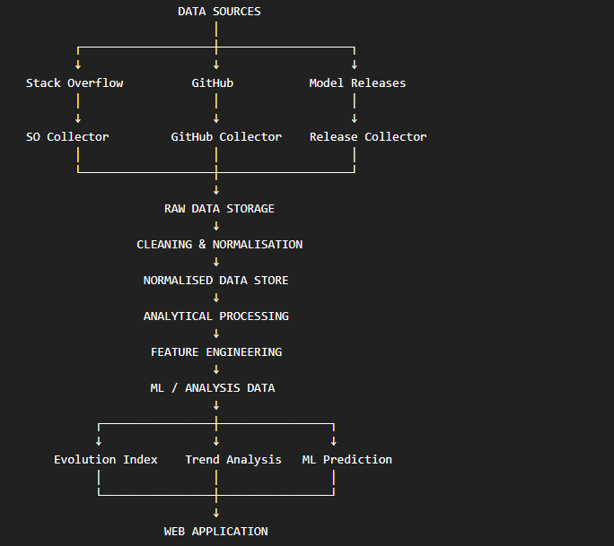

# Data Collection Architecture

**Project:** Machine Learning-Based AI Technology Evolution Analysis and Future Trend Prediction Platform  
**Document Version:** 1.0  
**Date:** 18 August 2026  
**Status:** Initial Architecture Design

---

## Table of Contents

1. [Architecture Objectives](#1-architecture-objectives)
2. [Overall Architecture](#2-overall-architecture)
3. [Data Source Layer](#3-data-source-layer)
4. [Data Collection Layer](#4-data-collection-layer)
5. [Raw Data Layer](#5-raw-data-layer)
6. [Data Processing Layer](#6-data-processing-layer)
7. [Normalised Data Layer](#7-normalised-data-layer)
8. [Analytical Data Layer](#8-analytical-data-layer)
9. [Database Architecture](#9-database-architecture)
10. [Data Entities](#10-data-entities)
11. [Data Collection Frequency](#11-data-collection-frequency)
12. [Data Quality and Validation](#12-data-quality-and-validation)
13. [Error Handling and Logging](#13-error-handling-and-logging)
14. [Data Lineage and Source Tracking](#14-data-lineage-and-source-tracking)
15. [Security and API Credentials](#15-security-and-api-credentials)
16. [Scalability and Extensibility](#16-scalability-and-extensibility)
17. [Initial Architecture Decisions](#17-initial-architecture-decisions)

---

## 1. Architecture Objectives**

The data collection architecture will be designed to provide a reliable and maintainable process for collecting, storing, processing, and integrating AI ecosystem data from multiple independent sources.

The main objectives of the architecture are:

1\. To collect data from multiple public and permitted data sources.

2\. To keep each source-specific collection process independent from the others.

3\. To preserve raw collected data before transformation.

4\. To support historical and incremental data collection.

5\. To standardise information from different sources into a common structure.

6\. To maintain traceability between processed information and its original source.

7\. To handle missing, duplicated, inconsistent, or invalid data.

8\. To respect API limits, access requirements, and applicable usage conditions.

9\. To allow additional data sources to be added without redesigning the entire system.

10\. To provide structured datasets suitable for exploratory analysis, NLP, feature engineering, and machine learning.

11\. To support future updates to the AI Evolution Index and prediction models.

12\. To provide a reliable foundation for the web-based application.

**## 2. Overall Architecture**

The proposed data architecture will use a layered approach. Each external data source will have its own collection process, while the resulting data will pass through common storage, processing, and analytical stages.

The high-level architecture is:

****Data Sources****

↓

****Source-Specific Collectors****

↓

****Raw Data Storage****

↓

****Data Cleaning and Normalisation****

↓

****Normalised Data Storage****

↓

****Analytical Data Processing****

↓

****Feature Engineering****

↓

****Machine Learning Dataset****

↓

****AI Evolution Analysis****

↓

****Web Application****

The architecture will separate data collection from data analysis so that new data can be collected without directly affecting the machine learning and web application components.

**## 3. Data Source Layer**

The data source layer represents the external sources from which information related to AI models, technologies, capabilities, and ecosystem activity will be obtained.

The initial source categories are:

| Source | Primary Signal | Status |

|---|---|---|

| AI Model and Release Data | Direct AI development | Core |

| Stack Overflow | Developer ecosystem | Core |

| GitHub | Open-source ecosystem | Core |

| Benchmark Data | Capability performance | Supporting |

| Hugging Face | Open-model ecosystem | Supporting |

| Reddit | Community ecosystem | Conditional |

| Google Trends | Public interest | Optional |

Each source will be treated as an independent data provider. The system will not assume that the structure, terminology, update frequency, or available fields are identical across sources.

Source-specific processing will therefore be performed before information is converted into the common analytical structure.

**## 4. Data Collection Layer**

The data collection layer will contain independent collectors responsible for retrieving information from each selected source.

The initial structure will be:

\`\`\`text

data_collection/

│

├── stackoverflow/

│   ├── collector.py

│   ├── api.py

│   └── config.py

│

├── github/

│   ├── collector.py

│   ├── api.py

│   └── config.py

│

├── model_releases/

│   ├── collector.py

│   ├── parser.py

│   └── config.py

│

├── benchmarks/

│   ├── collector.py

│   └── parser.py

│

├── huggingface/

│   ├── collector.py

│   └── api.py

│

└── reddit/

    ├── collector.py

    └── api.py

---

## 5. Raw Data Layer

All collected information will initially be preserved in a raw data layer before cleaning or transformation.

The purpose of the raw layer is to:

- Preserve the original collected information.

- Allow data processing to be repeated.

- Support debugging of collection and preprocessing errors.

- Maintain a historical record of collected data.

- Provide traceability between processed records and their original source.

- Allow future preprocessing methods to be tested without recollecting the original data.

The raw data layer may use source-specific formats such as JSON, CSV, or other appropriate structured formats.

A possible directory structure is:

\`\`\`text

data/

│

├── raw/

│   ├── stackoverflow/

│   ├── github/

│   ├── model_releases/

│   ├── benchmarks/

│   ├── huggingface/

│   └── reddit/

│

├── processed/

│

└── analytical/

---

## 6. Data Processing Layer

The data processing layer will transform source-specific raw data into consistent and structured information suitable for analysis.

The main processing stages will include:

1\. Data validation

2\. Duplicate detection

3\. Missing-value handling

4\. Data type conversion

5\. Date and time standardisation

6\. Text cleaning

7\. Technology name normalisation

8\. AI model name normalisation

9\. Entity identification

10\. Source-specific transformation

11\. Cross-source entity matching

12\. Data quality validation

For example, different references to the same technology may appear as:

\`\`\`text

GPT-4

GPT4

gpt 4

OpenAI GPT-4

---

## 7. Normalised Data Layer

The normalised data layer will contain standardised representations of information collected from different sources.

The purpose of this layer is to make information from different platforms comparable while preserving the original source information.

The initial common entities are:

- AI Model

- AI Technology

- AI Capability

- Organisation

- Release Event

- Ecosystem Activity

- Benchmark Result

- Technology Relationship

- Source Record

- Time Period

For example, activity from Stack Overflow, GitHub, and Reddit may use different terminology and structures. These records will be mapped to common concepts such as:

\`\`\`text

Technology

Date

Source

Activity Type

Activity Value

Model

Capability

---

## 8. Analytical Data Layer

The analytical data layer will contain aggregated and transformed information designed specifically for exploratory analysis, evolution analysis, feature engineering, and machine learning.

Examples of analytical indicators include:

- Monthly technology activity

- Technology growth rate

- Developer activity

- Open-source activity

- Community activity

- Model release frequency

- Capability growth

- Benchmark performance changes

- Model ecosystem growth

- Technology co-occurrence

- Sentiment indicators

- Technology lifecycle indicators

- Evolution Index components

The analytical layer will use consistent time periods, such as weekly or monthly aggregation, where appropriate.

The selected time granularity will depend on the availability, frequency, and quality of the collected data.

The analytical dataset will form the main input for the AI Evolution Index and machine learning experiments.

---

## 9. Database Architecture

The project will use a relational database to store structured information collected from multiple AI ecosystem data sources.

PostgreSQL will be considered as the primary database management system because it provides support for structured relational data, indexing, constraints, relationships, and analytical queries. It is also suitable for integration with the Flask backend and Python-based data-processing components.

The database will not replace the raw data storage layer. Instead, the architecture will separate raw source data from structured application and analytical data.

The proposed storage architecture is:

\`\`\`text

External Data Sources

        ↓

Source-Specific Collectors

        ↓

Raw Data Storage

(JSON / CSV / Other Raw Formats)

        ↓

Data Processing

        ↓

PostgreSQL

        ↓

Normalised Data

        ↓

Analytical Data

        ↓

Machine Learning

        ↓

Flask Backend

        ↓

React Web Application

---

## 10. Data Entities

The system will represent important AI ecosystem concepts as structured entities. These entities will provide a common representation across different data sources.

### 10.1 AI Model

Represents an individual AI model or model version.

Potential attributes include:

- Model ID

- Model name

- Model family

- Organisation

- Version

- Release date

- Model type

- Open-source status

- Source

Example:

\`\`\`text

Model:

GPT-4.1

Family:

GPT

Organisation:

OpenAI

Release Date:

2025

---

## 11. Data Collection Frequency

Different data sources may require different collection frequencies depending on their update rates, API limitations, and analytical value.

The initial collection strategy will use the following approach:

| Source | Initial Frequency | Purpose |

|---|---|---|

| AI Model / Release Data | Daily / event-based | Detect new releases and changes |

| Stack Overflow | Daily | Capture new developer activity |

| GitHub | Daily / weekly | Track repository and ecosystem changes |

| Benchmark Data | Event-based / periodic | Capture new evaluations |

| Hugging Face | Daily / weekly | Track model ecosystem changes |

| Reddit | Daily if access permits | Community activity |

| Google Trends | Weekly / periodic | Public interest trends |

These frequencies are initial estimates and will be refined after testing API limits, data volumes, and the actual rate of change within each source.

Historical data collection will be performed separately from ongoing incremental collection.

### 11.1 Historical Collection

The historical collection process will retrieve available historical records for the selected time period.

Historical collection may be performed in batches to avoid excessive API requests.

### 11.2 Incremental Collection

After the initial historical dataset has been established, future collection runs will retrieve only newly available or changed information where possible.

This will reduce unnecessary requests and improve collection efficiency.

### 11.3 Collection Timestamps

Each collected record will have an associated collection timestamp.

This will allow the system to distinguish between:

- When an event originally occurred.

- When the system discovered the event.

- When the record was last updated.

---

## 12. Data Quality and Validation

### 12.1 Validation Checks

The system may perform checks for:

- Missing required fields.

- Invalid dates.

- Duplicate records.

- Invalid identifiers.

- Unexpected data types.

- Empty text fields.

- Invalid numerical values.

- Inconsistent technology names.

- Inconsistent model names.

- Unexpected API responses.

### 12.2 Duplicate Detection

Duplicate records may occur when:

- Historical collection overlaps with incremental collection.

- APIs return overlapping pages.

- A collector is executed multiple times.

- Multiple sources reference the same external entity.

Unique external identifiers and source information will be used where available to reduce duplication.

### 12.3 Missing Data

Missing information will not automatically be replaced with assumed values.

The system will distinguish between:

\`\`\`text

Known value

Unknown value

Not applicable

Not available from source

---

## 13. Error Handling and Logging

The data collection system will include error handling to prevent temporary source or network problems from corrupting the dataset.

Potential errors include:

- Network failures.

- API authentication failures.

- API rate-limit responses.

- API backoff instructions.

- Invalid API responses.

- Timeout errors.

- Missing endpoints.

- Unexpected response formats.

- Data parsing errors.

The system will record errors in a structured logging system.

Each collection run should provide information about:

- Source.

- Start time.

- End time.

- Status.

- Number of records collected.

- Number of errors.

- Error messages.

- Retry attempts.

Temporary failures should be retried where appropriate using controlled retry and backoff mechanisms.

Persistent failures should be logged and should not cause previously collected valid data to be deleted.

---

## 14. Data Lineage and Source Tracking

The system will maintain information about the origin of collected and processed data.

Data lineage will allow an analytical result to be traced back through the processing pipeline to its original external source.

The intended lineage is:

\`\`\`text

Analytical Feature

      ↓

Processed Entity

      ↓

Normalised Record

      ↓

Source Record

      ↓

External Source

---

## 15. Security and API Credentials

Some data sources may require API keys, OAuth credentials, access tokens, or other authentication information.

Credentials will not be stored directly in source code or committed to the Git repository.

Sensitive configuration will be managed using environment variables or an appropriate local configuration mechanism.

For example:

\`\`\`text

STACKOVERFLOW_KEY

GITHUB_TOKEN

REDDIT_CLIENT_ID

REDDIT_CLIENT_SECRET

HUGGINGFACE_TOKEN

---

## 16. Scalability and Extensibility

The architecture will be designed so that additional data sources can be integrated without major changes to the existing system.

Each source will use an independent collector and source-specific processing stage.

For example:

\`\`\`text

data_collection/

├── stackoverflow/

├── github/

├── model_releases/

├── benchmarks/

├── huggingface/

├── reddit/

└── future_source/

---

## 17. Initial Architecture Decisions

The following architecture decisions have been established at the initial design stage:

1\. The project will use a multi-source data architecture.

2\. Each external source will have an independent collection process.

3\. Raw source data will be preserved before transformation.

4\. PostgreSQL will be used as the primary candidate for structured database storage.

5\. Source-specific data will be transformed into common normalised entities.

6\. Analytical data will be separated from raw source data.

7\. Historical collection and incremental collection will be treated as separate processes.

8\. API limits and source-specific access requirements will be respected.

9\. API credentials will be stored securely outside source code.

10\. Source information and collection timestamps will be preserved.

11\. The machine learning layer will not directly depend on external APIs.

12\. The architecture will support optional and future data sources.

13\. Reddit and Google Trends will not be required for the core system.

14\. The final database schema will be refined after testing representative samples from the selected sources.

15\. The final analytical features will be determined after exploratory analysis of the collected data.
